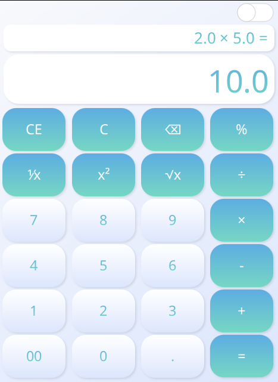

# 🧮 JavaFX Calculator App

## 📜 Description

A simple calculator application built using JavaFX for the user interface. This desktop application supports basic arithmetic operations such as addition, subtraction, multiplication, and division. The app features a responsive user interface with optional dark mode and includes utility classes for parsing operations and managing calculator states.

## 📝 Notes

- Ensure you have **Java 8** or later installed. 🌟
- You need a properly configured Java Development Kit (JDK) to run the application. 🛠️
- In case of missing dependencies, verify that all required libraries are included in the `lib` folder or declared in the `pom.xml` file. 🔍

## 🛠️ Usage

1. **Launch the Application**: 
   - Run the application by executing the `MainClass.java` in the `com.calculator.main` package. 🚀

2. **Calculator Interface**:
   - **Numeric Buttons**: Click or input numbers directly to the calculator. 🔢
   - **Operation Buttons**: Choose operations such as addition (`+`), subtraction (`-`), multiplication (`×`), division (`÷`) and more. ➕➖✖️➗
   - **Display**: The main display shows the current input and the result of calculations. 📟
   - **Equals Button**: Compute the result of the current (binary) operation. ✅
   - **Clear and Clear Entry Buttons**: Reset the current input or operation. 🧹
   - **Dark Mode Toggle**: Switch between light and dark modes for a customized user experience. 🌙

3. **Core Functionality**:
   - **Binary Operations**: Handle operations that involve two numbers (e.g., `5 + 3`). 
   - **Unary Operations**: Execute operations with a single operand (e.g., reciprocal or percentage).

## 📁 Project Structure

- `src/` - Source code directory
  - `com/`
    - `calculator/` - Java source files
      - `constants/` - Operator constants used throughout the application
      - `controller/` - Contains `CalculatorController.java` for managing the interface logic
      - `darkMode/` - Includes classes for handling dark mode (`DarkModeSwitcher.java`, `ToggleSwitch.java`)
      - `icon/` - Utility for loading application icons (`StageIconLoader.java`)
      - `main/` - Main entry point of the application (`MainClass.java`)
      - `parsers/` - Logic for parsing binary and unary operations
      - `state/` - Manages calculator state and operations (`CalculatorState.java`)
    - `test/` - Unit tests for the parser and constants classes
  - `resources/` - Resource directory
    - `assets/images/` - Icons and images for the application (`calculator.png`)
    - `styles/` - CSS for styling the application (`styles.css`)
    - `calculator-main.fxml` - FXML layout file for the calculator interface

## 🖼️ Screenshots

  
  

## 📜 License

This project is licensed under the MIT License. See the [LICENCE](LICENCE) file for details. 📝

## 📬 Contact
For questions, feedback, or support:
- **Author**: Kacper Górski
- **LinkedIn**: [Kacper Górski](https://www.linkedin.com/in/kacper-gorski-se)
- **Instagram**: [@kxcper.gorski](https://www.instagram.com/kxcper.gorski)
- **X**: [@Kerciuu](https://x.com/Kerciuu)
- **GitHub**: [Kerciu](https://github.com/Kerciu)
- **Support**: Email [kacper.gorski.contact@gmail.com](mailto:kacper.gorski.contact@gmail.com)
  
For any issues, please open a GitHub issue. 🚀
